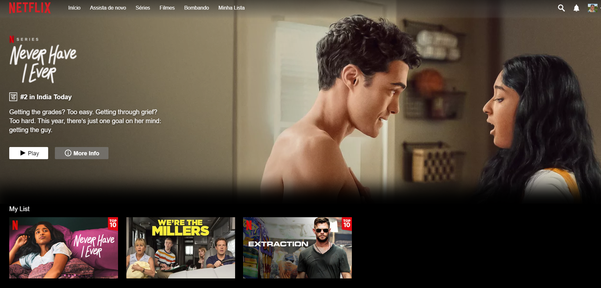

## Netflix Clone em Laravel

O presente projeto teve como objetivo maximizar skill em Laravel para a disciplina de Linguagem de Programação WEB I - IFSUL CHARQUEADAS - Tecnólogo em Sistemas para Internet 

- [Layout usado/modificado de origem](https://github.com/bahramzade/netflix-clone-cideigniter).
- Banco de dados MySQL/Migrate Laravel

Check
- Sistema WEB &#9989;
- Funções - Estrutura MVC &#9989;
- Formulário - Cadastro &#9989;
- Armazenamento - BD MySQL &#9989;
- Upload de arquivos &#9989;
- Sistema de Login - Auth &#9989;
- Escrita em arquivos - DATA/HORA LOGIN – EMAIL USUÁRIO – DATA/HORA LOGOUT &#9989;

 
 
 
 
 
 
 
